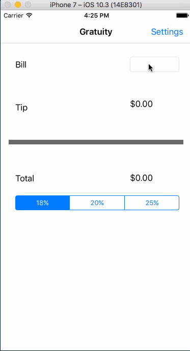
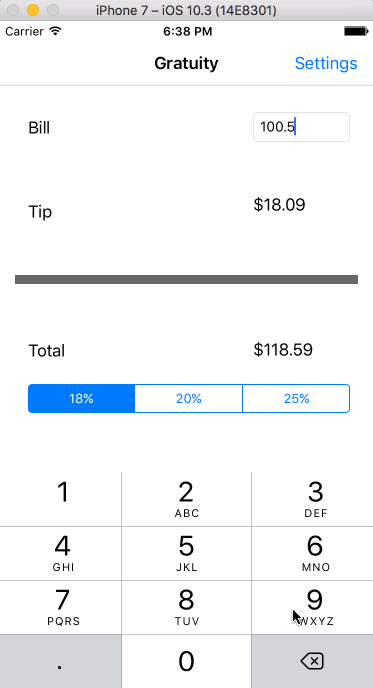
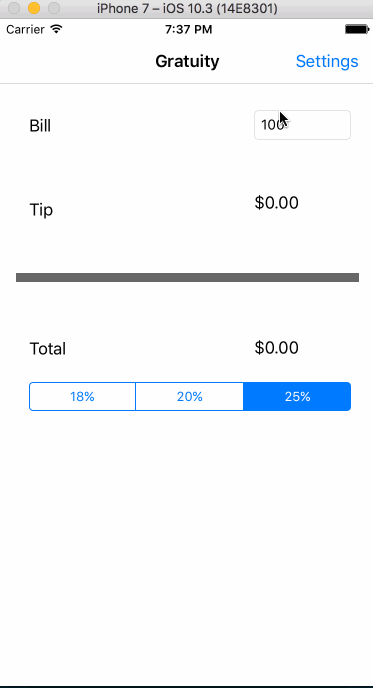
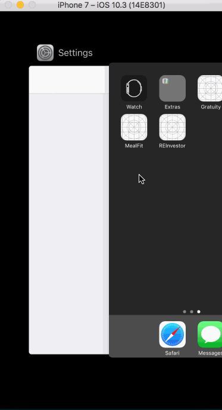

# Gratuity

A simple gratuity calculator for iOS.

Time spent: 2 hours (on and off)

## Features

- [x] Required: Basic functionality calculates gratuity amount based on bill amount
and gratuity percentage selected.
- [x] Required: Settings page that allows a user to set a default gratuity amount.
After a user visits the settings page, the gratuity percentage in the home screen
only changes if a new default value was selected. Visiting the settings view
displays the current default gratuity amount.
- [x] Optional: Remember the bill amount across app restarts.
After an 10 minutes, clear the state.
- [x] Optional: Use locale specific currency and currency thousands separator.
- [x] Optional: Add a light/dark color theme to the settings view.
- [x] Optional: Make sure the keyboard is always visible and the bill amount is always the first responder.

## Demos

**Initial Basic version**

**Remember bill amount across app restart & local specific currency**

**Light and dark UI themes**

**Bill amount is always first responder, keyboard displays automatically**

